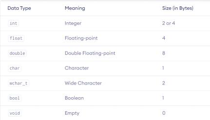

# Notes - 01

## Flow-Chart

Flowchart is a digramatic representation of an approach. This draws out all the steps of your approach in order.

## Components of Flow-Chart

### 1. Terminator

- Specifies the start and end of the program

### 2. Parallelogram

- For taking input or showing output

### 3. Rectangle

- For Operations and Processes

### 4. Diamond

- For Decision making

### 5. Arrows

- Flow of code

## Modulo Operator

- Gives the Remainder after Division
- 5 % 2 == 1

## Structure of C++ Initial Code

1. Preprocessor Directive: It runs before the program compiled and includes the file to used later in the source code.
   - A file called iostream has cout defined in it so.

        ```C++
        #include <iostream>
        ```

   - i/o means input/output

2. Namespaces:

    ```C++
        using namespace std;
    ```

3. endl : Used to enter new line, It is like "\n" which is new line escape sequence.

## Data Types

- Different types of data to be stored in memory and - you need to specify every data type in C++.  
- Eg: Integer, float, Character, double etc.  
- Different type of data types use different amound of memory.



### Size of Data types

- sizeof(variable_name);

## Variabe Nomenclature

- Can contain alphabets, numbers and underscores.
- Cannot start with a number.
- Cannot be keywords like int, cout, double etc.
- Cannot contain special symbols.

## Typecasting

- Conversion of one data type to another (if it is valid) called typecasting

    ```C++
    int a = 'a''
    ASCII value of 'a' = 97
    ```

- Automatic typecasting is called Implicit Typecasting

## How Negative numbers stored?

- The first bit tells us whether the number is positive or negative

```c++
    0 --> Positive
    1 --> Negative
```

### Steps to store negative Integer in binary format

1. Ignore the negative sign.
2. Write the binary representation of positive integer.
3. Take it's 2's compliment and store it.

## Why 2's Compliment

2’s complement is a process of representing negative integers in modern computer systems. It is achieved by adding 1 to a bitwise complement of a binary string.

## Relational Operators

```C++
    ==, >=, <=, !=
```

## Logical Operator

```C++
    && --> AND
    || --> OR
    ! ---> NOT
```

## cin.get()

cin.get() reads a string with the whitespace.

```c++
    cin.get(string_name,size);

    Example:
    char name[100];
    cin.get(name, 3);
    cout << name;
```

## Example of pattern question

- Code:

```C++
int n = 5;

    for (int i = 1; i <= n; i++)
    {
        for (int j = 1; j <= n - i + 1; j++)
        {
            cout << j << " ";
        }

        for (int j = 1; j <= i - 1; j++)
        {
            cout << '*' << " ";
        }

        for (int j = 1; j <= i - 1; j++)
        {
            cout << '*' << " ";
        }

        for (int j = 1; j <= n - i + 1; j++)
        {
            cout << n - j + 2 - i << " ";
        }
        cout << endl;
    }
```

- Pattern

```C++
1 2 3 4 5 5 4 3 2 1 
1 2 3 4 * * 4 3 2 1
1 2 3 * * * * 3 2 1 
1 2 * * * * * * 2 1
1 * * * * * * * * 1 
```